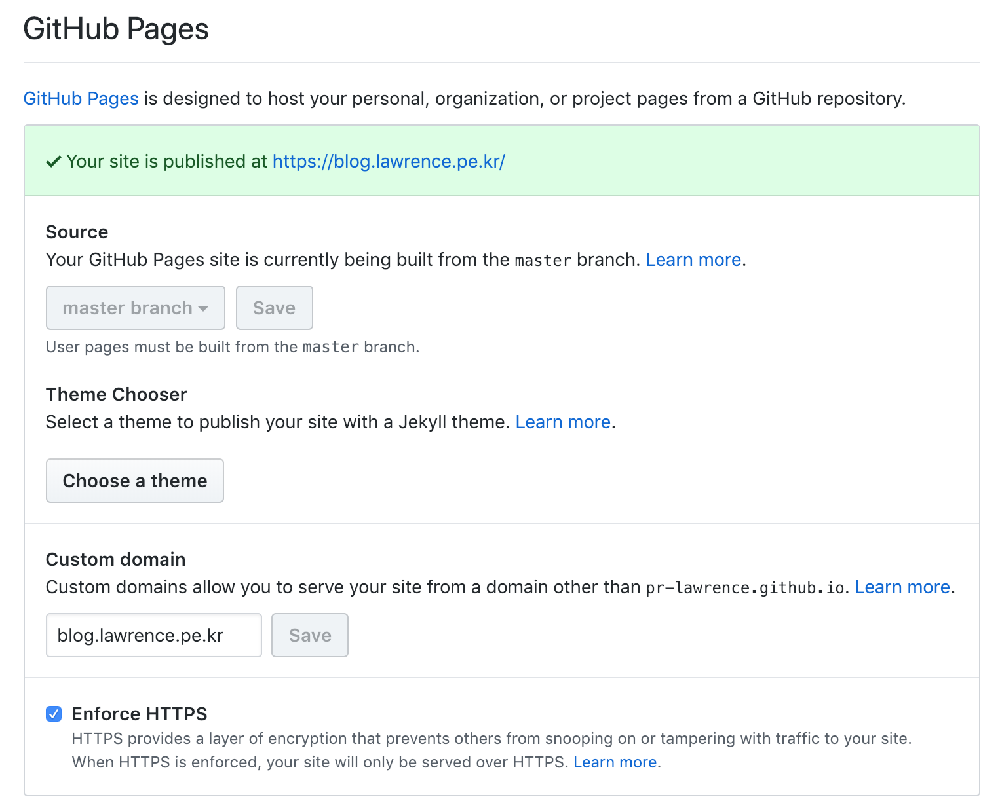

Github pages에서 custom 도메인을 설정하는 방법이다.

1. Github에서 custom domain 사용하도록 설정한다.
2. 프로젝트 최상단에 CNAME 파일이 생성된 것을 확인한다.
3. 도메인을 구입한 사이트에서 CNAME 관련 설정을 진행한다.

### Github에서 custom domain 사용 설정하기

Github pages용 저장소에 Settings 메뉴로 들어가면 아래와 같은 메뉴가 있다.

### 도메인을 구입한 사이트에서 CNAME 관련 설정하기
